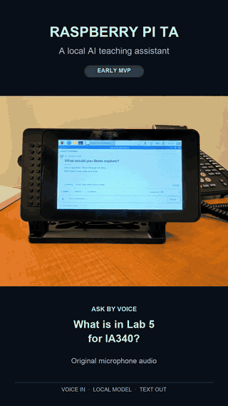

# LAITA — Local AI Teaching Assistant

A teaching assistant that runs locally, keeps a conversation going, answers questions using public course evidence, and lets one operator review saved work. LAITA is an independent faculty-led project, not an official James Madison University service or product.

**Public V1 · v0.1.0**. See [validation status and limitations](docs/VALIDATION.md).

## See it in action

A silent, 12-second excerpt at normal playback speed from a real earlier MVP recording. The original already shortened a waiting period. Its interface and branding differ from LAITA Public V1; no product text or UI state was fabricated. [Watch/download the full 28-second MP4](docs/assets/demo/laita-pi-demo.mp4) · [Media provenance and privacy review](docs/SCREENSHOTS.md).

## What you can do

- **Chat locally:** `gemma4:12b-mlx` by default, with an explicit `llama3.1:8b` alternative. Continue across turns, cancel a response, or start a new conversation.
- **Choose your provider:** Local / optional OpenAI / Compare, with visible provider/model attribution and no silent fallback. OpenAI uses your own key through server-side macOS Keychain.
- **Ask course-grounded questions:** demo-course public sources, bounded evidence and visible citations. Insufficient evidence stops the request before model invocation.
- **Review saved work:** local [History & Review](docs/HISTORY.md) at `/history`, including search, Problems, sources, feedback and operator review.
- **Use optional local speech:** the reference adapters support English/Chinese recognition and spoken replies when configured. Text answers depend on the selected model's language capability; this does not establish broader speech support.

This real capture also shows an earlier interface. Hardware and dashboard images are in the deployment and History guides.

## Start with Local

Follow [Getting started](docs/GETTING-STARTED.md) for prerequisites, installation, configuration, model setup and the first conversation. The reference deployment uses an Apple Silicon Mac, Ollama, Node 24 and an operator-controlled HTTPS entry on loopback. OpenAI is optional.

| Guide | What it covers |
|---|---|
| [Demo courses / Course-grounded Q&A](docs/COURSE-GROUNDING.md) | Source refresh, visible citations, evidence refusal and substituting supported public course material |
| [OpenAI / Compare](docs/OPENAI.md) | Cloud data flow, interactive Keychain setup, enabling, missing credentials, rotation and deletion |
| [History & Review](docs/HISTORY.md) | Retained records, feedback, operator review and access limitations |
| [Speech and Pi client](docs/SPEECH.md) | English/Chinese reference support, local adapters and hardware acceptance |
| [Deployment](docs/DEPLOYMENT.md) | Operator-owned macOS lifecycle, hardware photos, HTTPS and recovery |

## Privacy and current limits

Local inference and course evidence remain on your host. Optional OpenAI sends eligible general questions and bounded provider-specific context to OpenAI; course excerpts and archived History are not sent. Text history persists locally; microphone and generated audio are temporary. See [data flow](docs/ARCHITECTURE.md) and [security policy](SECURITY.md).

V1 is **single-operator**: History has no separate password or multi-user isolation, and the reference entry stays on loopback. There is one admitted operation with no queue, bounded context/retrieval, and two explicit public demo-course mappings. It is not a student account, LMS or grading platform. Live model quality, Cloud account availability, real speech quality and physical hardware acceptance are not established by synthetic tests. [Validation and limitations](docs/VALIDATION.md).

## Author, support and community

Created and maintained by **Xuebin Wei, Ph.D.**, Associate Professor in JMU's Intelligence Analysis program. [Verified professional profile and project background](docs/ABOUT.md).

Thank you to JMU's School of Integrated Sciences and College of Integrated Science and Engineering, including CISE Faculty Mini Grant and Educational Leave support. Acknowledgment does not imply institutional endorsement. [Official names and acknowledgments](docs/ABOUT.md#acknowledgments).

Bug reports and focused feature requests are welcome through [GitHub Issues](https://github.com/xbwei/local-ai-teaching-assistant/issues). Use a minimal, non-sensitive reproduction. [Contributing](CONTRIBUTING.md) · [Validation & limitations](docs/VALIDATION.md).

LAITA-authored software is under the [MIT License](LICENSE). Models, course content, dependencies and recorded media retain their own rights; see [third-party boundaries](THIRD_PARTY.md).
