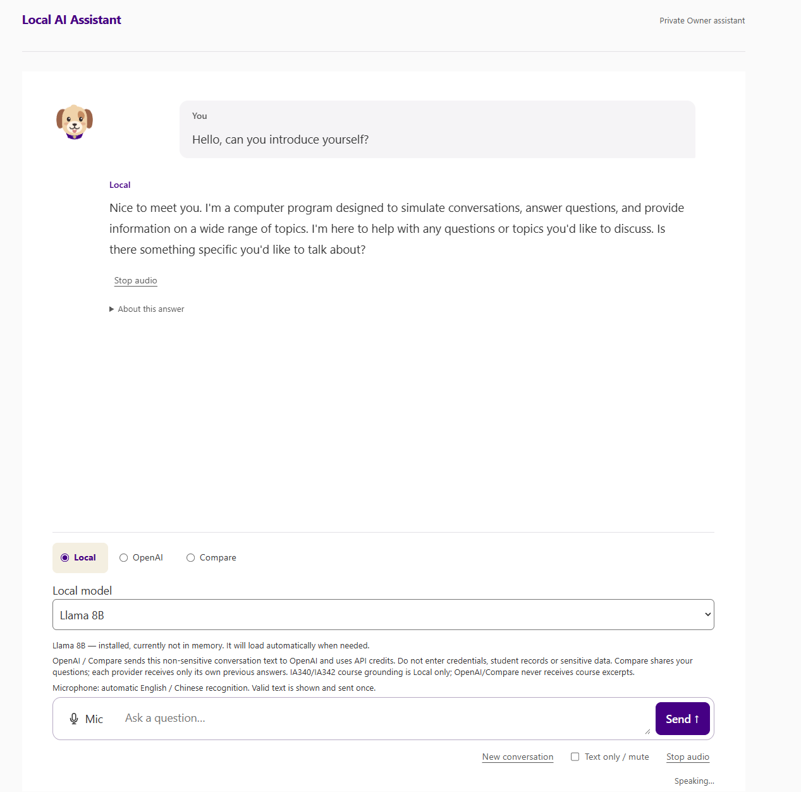
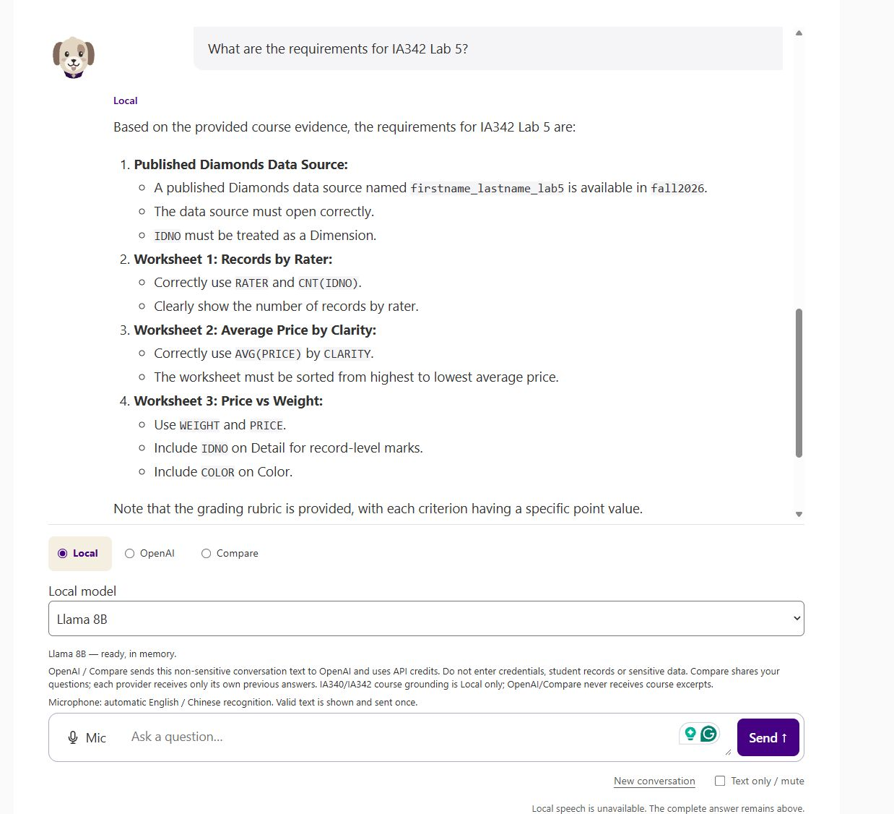
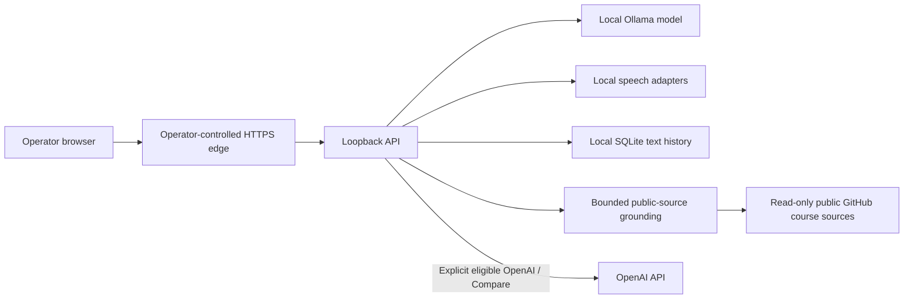

<p align="center"></p>

# LAITA — Local AI Teaching Assistant

LAITA is an independent faculty-led, open-source teaching assistant for one operator. Run a local model, discuss ideas across multiple turns, ask questions grounded in public course sources, and review locally retained text at `/history`. It is not an official James Madison University service or product.

**Status: Public V1 candidate, intended version 0.1.0.** Merge, public visibility, and the initial `v0.1.0` release remain separate maintainer decisions. No student platform or institutional deployment approval is claimed.

## Features

- **Local by default:** `gemma4:12b-mlx`; explicit `llama3.1:8b` alternative. At most one primary Local model is resident. Switching unloads the previous model; a failed switch is visible.
- **Local / OpenAI / Compare:** OpenAI is optional, uses your API key, and never replaces a failed Local model silently. Compare retains independent provider/model attribution.
- **Real conversation:** bounded recent context, cancellation, and New conversation. Compare sends each provider its own previous answers.
- **Local course grounding:** IA340 / IA342 public Markdown sources, bounded evidence and visible repository/commit/path/section citations. Insufficient evidence stops before model invocation.
- **Local bilingual speech when configured:** English/Chinese recognition with whisper.cpp, macOS spoken replies, and text-only/mute controls. Long answers remain readable even when spoken output is skipped.
- **History & Review:** All records, Problems, search/filter, provenance, execution detail, feedback and operator review. This is a single-operator dashboard.

## Visual walkthrough

These real screenshots and hardware photos were supplied and approved by the Owner. They show an earlier working interface; its name, mascot and colors differ from the Public V1 candidate. Product text and states have not been fabricated or retouched. Hardware photos are illustrative, not proof of this candidate's hardware acceptance. See [source mapping and privacy edits](docs/SCREENSHOTS.md).





The course capture shows the answer and selected Local model; it does not show the expanded citation panel. Current source-provenance behavior is documented below and checked separately.


## Architecture and data flow



The browser never receives an OpenAI key. Public-source refresh requests go to GitHub; downloaded Markdown snapshots stay in your local runtime directory. Grounded course requests use Local only; OpenAI/Compare does not receive course excerpts. Eligible general OpenAI requests send bounded active non-sensitive questions and that provider's prior answers. The Responses adapter requests `store: false`; OpenAI's own service/data policies still apply. Browsing archived History calls neither provider. [Architecture and boundaries](docs/ARCHITECTURE.md).

## Prerequisites

The reference environment is a single operator on **Apple Silicon macOS** with Ollama supporting MLX, Node **24.16.0** and npm **11.13.0**. Runtime compatibility is also checked with Node 24.19.0/npm 11.17.0; declared engines are Node >=24.16 <25 and npm >=11 <12. Python is optional developer tooling, not a runtime backend.

Reserve enough memory for your model plus the operating system; 24 GB unified memory is a practical reference choice, not a guaranteed minimum. See the [official Ollama Gemma MLX notes](https://ollama.com/blog/mlx-performance) and [model tags](https://ollama.com/library/gemma4/tags). `gemma4:12b-mlx` requires supported Apple Silicon/MLX; do not silently substitute another tag on unsupported hardware.

You need Git, an operator-controlled HTTPS reverse proxy, and a modern browser. The Quick Start gives a **loopback-only Caddy reference configuration** for the existing HTTPS transport boundary. It is deployment infrastructure, not another application backend. Caddy must be installed separately and its local CA trusted on your operator browser. Do not expose this configuration to a network.

## Quick Start — Local only

Install the prerequisites first. These commands use only this repository and your own local runtime. No OpenAI key is needed.

```bash
git clone https://github.com/xbwei/local-ai-teaching-assistant.git
cd local-ai-teaching-assistant
npm ci --ignore-scripts
npm run build
ollama pull gemma4:12b-mlx
ollama pull llama3.1:8b
```

Start Ollama using its macOS app or `ollama serve` if it is not already running. Install only models you intend to use; the alternate can be installed later. Do not run a second Ollama server on an occupied port.

Create an operator configuration **outside the checkout**. The accepted configuration requires an independent server-control verifier; this generates your own control token and stores only its hash in JSON. The protected token file is for existing server-control APIs, not OpenAI and not a dashboard login:

```bash
umask 077
mkdir -p "$HOME/.local/share/laita/config"
chmod 700 "$HOME/.local/share/laita/config"
node --input-type=module <<'JS'
import { readFileSync, writeFileSync } from 'node:fs';
import { homedir } from 'node:os';
import { randomBytes, createHash } from 'node:crypto';
const config = JSON.parse(readFileSync('ops/macos/application-config.json.template', 'utf8'));
config.runtimeRoot = `${homedir()}/.local/share/laita/runtime`;
// Existing server-control credential; never used as a browser/dashboard login.
const controlToken = randomBytes(32).toString('base64url');
config.access.enabled = true;
config.access.adminCredentials = [{ id: 'operator-control', tokenSha256: createHash('sha256').update(controlToken).digest('hex'), expiresAtEpochSeconds: Math.floor(Date.now()/1000) + 30*86400, revoked: false }];
writeFileSync(`${homedir()}/.local/share/laita/config/control-token`, controlToken, { mode: 0o600 });
writeFileSync(`${homedir()}/.local/share/laita/config/application.json`, JSON.stringify(config, null, 2), { mode: 0o600 });
JS
npm run course-sources:refresh -- "$HOME/.local/share/laita/runtime"
```

Public course refresh is optional for general chat. It needs read-only access to public GitHub APIs, uses no GitHub token, and can hit unauthenticated rate limits. Missing course evidence fails visibly; it does not trigger ungrounded answering.

In one terminal, start the API, which also serves the built UI:

```bash
APP_CONFIG_JSON="$(cat "$HOME/.local/share/laita/config/application.json")" npm start
```

In another terminal, from the same checkout, start the loopback HTTPS edge:

```bash
caddy run --config ops/reference/Caddyfile --adapter caddyfile
```

Open **https://localhost:3443**. Trust only the local CA you installed yourself; do not bypass unexpected certificate errors. The backend port 3100 is loopback-only and is not the browser entry. The HTTPS edge overwrites transport headers and applies one operator identity; all browsers using this entry share the same operator scope.

Try a general question, then a follow-up. Open `/history` from the UI. Stop foreground processes with Ctrl-C. Unset `APP_CONFIG_JSON` selects a fail-closed developer scaffold rather than this full operator profile; `.env` is not loaded automatically.

## Models and provider modes

Use the visible Local model selector to switch explicitly between Gemma 12B and Llama 8B. LAITA unloads the old primary model, checks the selected model and uses bounded idle residency. It does not install models or fall back automatically. `ollama list` shows installed models. Download errors, unavailable tags or resource pressure require operator action.

Local-only configuration sets `features.openai` and `features.compare` to `false` and `providers.openai.secretReference` to `null`. The UI shows configured modes and visible availability. An unavailable selected mode remains unavailable until you explicitly choose another mode.

## Optional OpenAI and Compare

Use your own OpenAI API account/key; usage incurs your provider's API charges. The server resolves a one-use secret handle from **macOS Keychain**. There is no plaintext key configuration option. Never put a key in `.env`, JSON, browser storage, SQLite, logs, tests, screenshots or Git.

Use the macOS Keychain Access app to create a **password item** named `org.laita.openai` with account `laita-operator` and enter the secret in the password field. Alternatively, this terminal command prompts for the secret interactively, without placing it in shell history:

```bash
/usr/bin/security add-generic-password -U -s org.laita.openai -a laita-operator -w
```

Run the command in your own interactive terminal; respond to its password prompt. Do not add a `-w actual-key` argument. The Keychain item must be accessible to the account running the API. OS permission prompts or inaccessible items are failures, not reasons to add plaintext fallback.

Edit only the non-secret operator JSON:

```json
{
  "features": { "local": true, "openai": true, "compare": true, "speech": false },
  "providers": {
    "openai": {
      "provider": "OPENAI",
      "model": "gpt-5.6-luna",
      "secretReference": { "kind": "opaque", "id": "laita-openai-primary" }
    }
  }
}
```

This is a **fragment**, not a complete config: retain the existing Local provider, provenance, access, runtime and server fields. The accepted OpenAI model is `gpt-5.6-luna`; account/model availability must be checked by you. No live Cloud validation or API spend is part of the candidate's automated tests.

Restart the foreground API with non-secret mapping names:

```bash
LAITA_OPENAI_KEYCHAIN_SERVICE=org.laita.openai \
LAITA_OPENAI_KEYCHAIN_ACCOUNT=laita-operator \
APP_CONFIG_JSON="$(cat "$HOME/.local/share/laita/config/application.json")" npm start
```

A missing mapping disables availability. A mapped but missing/inaccessible item is reported on execution as credential/provider failure; startup health is not proof the item exists. Local remains usable and there is no silent fallback. To disable Cloud, restore the two flags to false and the reference to null, then restart without the mapping environment variables.

To rotate, update the same Keychain item using Keychain Access or repeat the interactive `add-generic-password -U` command, then start a fresh API process. To remove it:

```bash
/usr/bin/security delete-generic-password -s org.laita.openai -a laita-operator
```

Disable Cloud in configuration too. Removing a key does not erase already retained text. [Deployment details](docs/DEPLOYMENT.md) cover LaunchAgent mapping and local service operations.

## IA340 / IA342 public demos

The configured references are [JMU-Data/IA340](https://github.com/JMU-Data/IA340) and [JMU-Data/IA342](https://github.com/JMU-Data/IA342). Their content is fetched read-only, not bundled wholesale or relicensed by LAITA. Repository, commit, document path and section are displayed with each source.

After refresh, select Local and try:

| Demo | Question | Inspect |
|---|---|---|
| Overview | What will I learn in IA340? | Course overview sources, not an unrelated lab |
| Lab | What must I submit for IA342 Lab 5? | Exact lab and relevant section |
| Week | IA340 Week 1 | Matching module/weekly evidence |
| Bilingual | IA342这门课学什么？ | Course identity and bounded Chinese/English grounding |
| Unsupported | Does IA340 teach a secret Mars evacuation protocol? | Evidence refusal and no provider invocation |

Course material can change. These examples are representative retrieval checks, not guarantees of model correctness. Sources must support the actual answer. Whole-course comparisons and unsupported specific claims fail closed. [Grounding, refresh and customization](docs/COURSE-GROUNDING.md).

**Custom public course sources:** V1 supports only the two explicit course identifiers/repository mappings. Substituting a public GitHub Markdown course requires a focused source-code change to the mapping and source contracts plus validation; arbitrary URLs/uploaded private courses are not a runtime feature. The customization guide identifies those boundaries rather than pretending there is a universal importer.

## History & Review

At `/history`, inspect All records or Problems, search/filter, complete retained question/transcript/answer text, provider/model attribution, source snapshot identity, execution detail, feedback and operator review. Pending review alone does not imply a problem. Browsing history never sends archived text to Cloud.

Text and associated diagnostics/provenance are retained in the existing local SQLite database. No automatic expiry or deletion schedule is implemented. New conversation resets active model context; it does **not** delete archived history. Raw microphone audio and generated speech are temporary. [History and privacy](docs/HISTORY.md).

This dashboard has no separate password and no multi-user isolation. Any person who can reach your operator-controlled entry can access the operator's History & Review. Keep the reference listener on loopback. An Internet or shared-network deployment is outside the reference Quick Start.

## Speech and Raspberry Pi

Speech is optional. Text chat works without whisper.cpp, audio devices, or voices. To enable it, install the pinned whisper.cpp Small Multilingual model and validated binary, prepare the non-secret STT profile, select English/Chinese macOS voices, and set `features.speech` to true. [Speech setup](docs/SPEECH.md).

The Pi is a browser thin client; inference, grounding, text storage and speech adapters run on the host Mac. A remote Pi requires your own protected HTTPS network entry and certificate trust; the loopback Quick Start is intentionally local. Microphone access requires a secure context. Responsive/browser audio tests use synthetic fixtures; physical Pi display, microphone, speaker and real transcription accuracy require your own acceptance. Long replies may deliberately skip synthesis while keeping complete text.

## Privacy and security

Use only non-sensitive operator-owned text. Do not submit credentials, student identifiers/records, grades, private assignments, research records or sensitive institutional material. Pattern-based safety checks cannot identify every sensitive input.

Runtime text and public-source snapshots live outside Git in a protected local directory. Temporary audio is not archived. LAITA does not supply encrypted-at-rest storage, a multi-user login system, a queue, or a separate dashboard password. Protect the macOS account/disk and your HTTPS edge. One operation is admitted at a time; contention returns BUSY rather than queues. See [SECURITY.md](SECURITY.md).

## Deployment, troubleshooting and recovery

[Deployment guide](docs/DEPLOYMENT.md) documents configuration, the loopback HTTPS boundary, LaunchAgent service lifecycle, explicit updates and rollback. It uses operator-owned paths and secrets only.

| Symptom | Check / recovery |
|---|---|
| UI unavailable / FORBIDDEN | Use the configured HTTPS origin; check proxy overwrites and exact origin. Do not expose or fake trusted headers from the browser. |
| Local unavailable | Start Ollama, run `ollama list`, install the exact selected tag and refresh choices. No silent model/provider substitution. |
| Grounding missing/stale | Refresh sources; check GitHub network/rate limit and snapshot status. Preserve failure rather than invent evidence. |
| OpenAI unavailable | Check flags, non-secret reference mapping and your Keychain item/account permissions. Never print the key for diagnosis. |
| BUSY | Wait for/cancel the admitted operation; no queue or background worker is created. |
| Invalid configuration | Check complete JSON and v4 provenance; empty/malformed `APP_CONFIG_JSON` does not fall back to defaults. |
| History recording incomplete | Stop admissions and preserve the local runtime; check storage permissions/capacity. Do not treat partial capture as success. |
| Speech unavailable / long answer silent | Check validated profile/voices, mute/autoplay status and documented speech bounds. Complete text remains available. |
| Restart budget exhausted | Fix the cause, then explicitly restart using `service.sh`; do not blindly loop retries. |

## Development and validation

See [CONTRIBUTING.md](CONTRIBUTING.md) and [validation guide](docs/VALIDATION.md). Locked dependencies, build, typecheck, boundaries, tests, process/workspace smoke, policy contracts, actionlint, audit, Git-history secret scan, and Semgrep CE are required gates. Tests use synthetic providers/secrets/media; they do not validate real model quality or Cloud account availability.

Known limits: single operator; one admitted operation/no queue; bounded context/retrieval; two explicit public courses; no guaranteed answer correctness; macOS speech/Keychain reference; no student accounts/LMS/grading/monitoring; no institutional certification; no live paid API test; no physical hardware guarantee. Broader platform support needs its own validation.

## Author and maintainer

**Xuebin Wei, Ph.D.** is an Associate Professor in the Intelligence Analysis program at James Madison University. His public professional interests include data analysis, visualization and machine learning. See the [official faculty profile](https://www.jmu.edu/cise/people/faculty/wei-xuebin.shtml) and [faculty expert profile](https://www.jmu.edu/university-communications/faculty-experts/experts/wei-xuebin/index.shtml). LAITA is maintained independently, not on behalf of JMU.

## Acknowledgments

Thank you to James Madison University’s [School of Integrated Sciences (SIS)](https://www.jmu.edu/cise/depts/sis/) and [College of Integrated Science and Engineering (CISE)](https://www.jmu.edu/cise/) for support, including a CISE Faculty Development Grant and [CISE Educational Leave](https://www.jmu.edu/cise/committees/faculty-leave.shtml) support. LAITA is an independent faculty-led project; acknowledgment of JMU support does not imply institutional endorsement or that LAITA is an official JMU service or product. Thank you also to the open-source maintainers listed in [THIRD_PARTY.md](THIRD_PARTY.md).

## License and community

LAITA-authored software and synthetic fixtures are under the [MIT License](LICENSE). Models, public courses, dependencies, datasets, voices and marks retain their own terms; see [third-party boundaries](THIRD_PARTY.md).

Bug reports and focused feature requests are welcome through [GitHub Issues](https://github.com/xbwei/local-ai-teaching-assistant/issues). Share minimal synthetic reproductions, versions and redacted errors; never attach private history, keys, student material or runtime databases. For vulnerabilities, follow [SECURITY.md](SECURITY.md).
