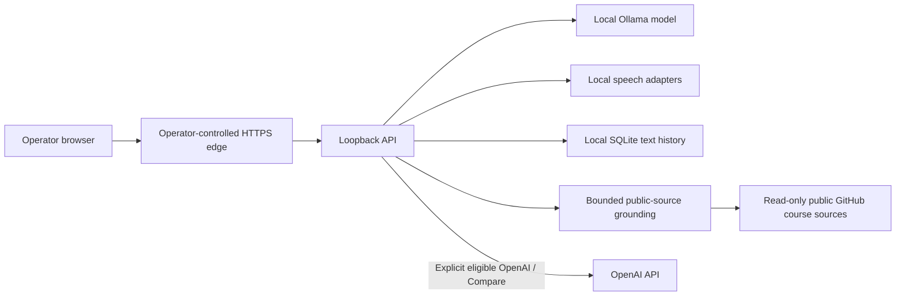

# Architecture

LAITA has eleven npm workspaces and one loopback API serving the built browser UI. A trusted operator-controlled HTTPS edge supplies transport protection. It is not an authentication service: all clients of an entry share one operator scope. The API admits one operation with no queue and coordinates policy, providers, grounding, speech and the existing local SQLite store. See the checked [module graph](MODULES.md).

Local Ollama runs on loopback with one primary model resident; explicit switching and failures are visible. Optional OpenAI calls use a server-only Keychain secret handle, bounded eligible active context and `store: false`. There is no provider/model fallback. Compare uses independent legs and provider-specific previous answers.

Public course GitHub fetches are read-only and unauthenticated. Bounded Markdown snapshots remain local. Query-triggered freshness is checked after 24 hours; refresh/source validation failures remain visible. Only the Local grounded leg receives evidence. No vector database or new persistent store exists.

The local store retains text/transcripts/answers, sources, provider/model identity, execution diagnostics, feedback and review state. Opening History does not invoke providers. Temporary recording/synthesis files are cleaned on their documented job/session lifecycle; they are not archived in history. Local logs use allowlisted event metadata rather than raw conversation or secrets.

## Data flow

The browser never receives an OpenAI key. Public-source refresh requests go to GitHub; downloaded Markdown snapshots stay in your local runtime directory. Grounded course requests use Local only; OpenAI/Compare does not receive course excerpts. Eligible general OpenAI requests send bounded active non-sensitive questions and that provider's prior answers. The Responses adapter requests `store: false`; OpenAI's own service/data policies still apply. Browsing archived History calls neither provider. [Architecture and boundaries](ARCHITECTURE.md).
