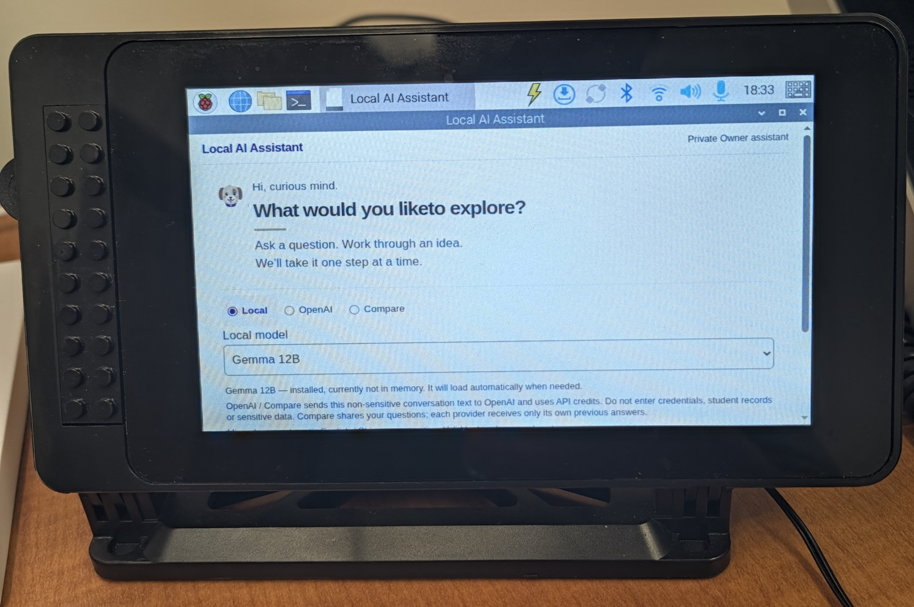
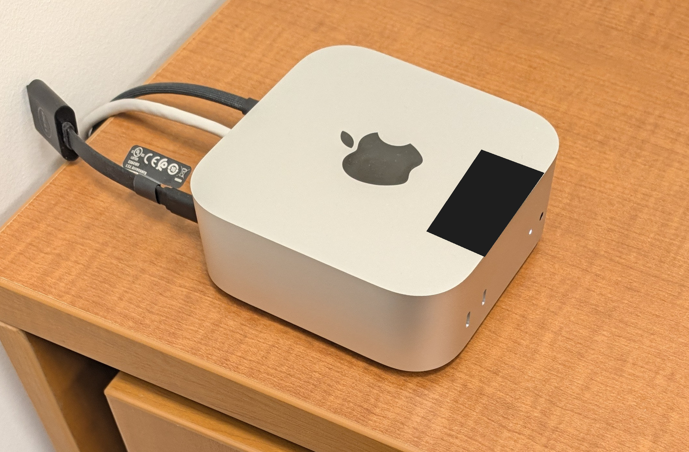

# Operator-owned macOS deployment

Use the [Local Quick Start](GETTING-STARTED.md) first. LAITA runs one application API serving the built UI on loopback. It relies on an operator-controlled HTTPS edge; the supplied Caddyfile binds only `127.0.0.1`. Install/manage Caddy separately, trust its local CA on your operator browser, and validate the file with `caddy validate --config ops/reference/Caddyfile --adapter caddyfile`. The file disables the admin listener and redirects and contains no passwords.

The reference edge requires TLS SNI to match the Host hostname and checks the exact `Host` including port, overwrites `X-Forwarded-Proto` and `X-Forwarded-Host`, and strips `Forwarded` and `Authorization`. Browser-supplied security forwarding headers cannot establish trust. Caddy’s default forwarding behavior replaces untrusted `X-Forwarded-For`; do not add browser clients to trusted proxies. The API continues to require the configured HTTPS origin and same-origin mutations.

Preserve `X-Owner-Client`: it is a browser-generated 64-hex **transient client reference**, not an authority, secret, account or login token. Each page instance has independent temporary conversation/session references. Opening or resetting B must not cancel A. All pages still share single-operator History and the global one-operation BUSY/no-queue limit; there is no per-user History. A shared network entry must have an independent operator-only protection mechanism before it is usable; V1 does not implement authentication or per-user isolation for History.

Static pages, the capture worklet and `/assets` share a process-wide limit of 600 requests per 60-second window, checked before file access. Only GET and HEAD count; excess requests return HTTP 429 / `RATE_LIMITED`. Unsupported methods do not consume the static budget. Input and History share their own separate transport limit of 600 requests per 60 seconds, so static traffic does not consume their budget. These limits do not replace the operator network boundary.

Do not point the reference edge at another host or bind it to all interfaces. The backend must remain on loopback. The Quick Start is one operator's Mac, not an Internet deployment or student pilot. Your own HTTPS edge, macOS account and network policy protect History access.

## Configuration

`ops/macos/application-config.json.template` is the complete Local-only v4 profile. Replace the runtime placeholder with a canonical absolute directory outside every Git tree, including sibling worktrees. Keep operator config in a 0700 directory, with the JSON file mode 0600. The runtime creates the existing SQLite text store plus bounded public-source snapshots and temporary audio directories; no private checkout/database is required.

The template intentionally has access disabled and no live control verifier. Use the Getting started provisioning step to generate your own independent server-control token/verifier and enable the operator entry. Protect the token file and rotate/revoke its 30-day record for continued use of server-control APIs. This credential does not protect the browser History dashboard; the operator HTTPS boundary does.

`APP_CONFIG_JSON` supplies the complete non-secret JSON. `.env` is not loaded. Absent input selects a fail-closed developer scaffold, and invalid/empty input is an error. `packages/runtime/examples` includes synthetic lower-level access/configuration test profiles; use the operator template for full Public V1 chat/history.

Models are fixed explicit choices: Gemma 12B MLX default and Llama 3.1 8B alternate. Cloud flags and an opaque reference are optional. Reference names `LAITA_OPENAI_KEYCHAIN_SERVICE` / `LAITA_OPENAI_KEYCHAIN_ACCOUNT` map the operator's own Keychain item; they are not secret values. Never inject an API key through environment/JSON. See [OpenAI setup](OPENAI.md) for interactive provisioning, missing credential behavior, disabling, rotation and removal.

## Optional LaunchAgent lifecycle

The existing generic `ops/macos/service.sh` packages immutable releases, keeps runtime/config separate, bounds crash restarts, and provides status, health, readiness, update and rollback. It is not a universal installer. Run it only on your own authorized Mac after reviewing its paths. The following is a configuration example, not a deployment performed by this PR.

Start from a clean **detached checkout** at the exact approved commit, with `origin/main` matching it. The script rejects a branch checkout, dirty tree, overlapping roots or unmanaged deployment directory. It installs a release in a previously absent deployment root and leaves the service disabled until explicit start.

```bash
export LAITA_CHECKOUT="$PWD"
export LAITA_EXPECTED_COMMIT="$(git rev-parse HEAD)"
export LAITA_NODE_BIN="$(command -v node)"
export LAITA_DEPLOY_ROOT="$HOME/.local/share/laita/deploy"
export LAITA_RUNTIME_ROOT="$HOME/.local/share/laita/runtime"
export LAITA_CONFIG_FILE="$HOME/.local/share/laita/config/application.json"
export LAITA_SERVICE_LABEL=org.laita.api
export LAITA_SERVICE_PLIST="$HOME/Library/LaunchAgents/org.laita.api.plist"
export LAITA_SERVICE_PORT=3100
bash ops/macos/service.sh install
bash ops/macos/service.sh start
bash ops/macos/service.sh status
bash ops/macos/service.sh readiness
```

Prerequisites: Node/npm compatibility, reviewed candidate, locked dependencies/network for build, valid protected operator JSON, writable owner-controlled roots, Ollama and the separately managed HTTPS edge. These commands are for the merged approved revision; a candidate branch is not yet an authorized deploy target. The LaunchAgent does not install/start Ollama, Caddy or model weights.

For optional Cloud, keep the Keychain mapping file outside Git in a 0700 directory, mode 0600, and create it using only synthetic/non-secret identifiers corresponding to **your** Keychain item:

```bash
export LAITA_OPENAI_KEYCHAIN_MAPPING_FILE="$HOME/.local/share/laita/config/keychain-mapping.json"
LAITA_OPENAI_KEYCHAIN_SERVICE=org.laita.openai \
LAITA_OPENAI_KEYCHAIN_ACCOUNT=laita-operator \
node ops/macos/prepare-provider-config.mjs mapping "$LAITA_OPENAI_KEYCHAIN_MAPPING_FILE"
```

The renderer validates the mapping and emits only service/account names to the plist. Local-only install requires no mapping and does not inspect Keychain. The installed app must run under the account owning the item. OS item-access prompts remain possible; never solve them with unrestricted `security -A` or plaintext fallback. If speech is enabled, keep the validated `stt-profile.json` in the deployment's protected `private` directory; the runner exports its path automatically.

## Explicit update and recovery

Stop/cancel active work before a planned update. Fetch and verify the exact reviewed approved public revision into a clean detached checkout, update `LAITA_EXPECTED_COMMIT`, and use `bash ops/macos/service.sh update`; then separately start. Verify `version`, `status`, `health`, `readiness`, browser access, provider identity and History. A health response alone does not prove inference/browser/hardware readiness.

The script snapshots the existing SQLite database before a migration and preserves it when the prior release is compatible. To roll back, set `LAITA_ROLLBACK_BACKUP` to the appropriate owner-controlled backup and invoke `rollback`, then separately `start`. Do not guess the backup, erase history or blindly retry an uncertain operation. The `remove` command removes the launcher/config/current pointer but preserves releases, backups and runtime text; it is an explicit operator action, not cleanup performed here.

A restart-budget failure requires diagnosis and an explicit `restart`; do not auto-loop retries. Preserve incomplete history/storage evidence. Do not copy raw databases, logs or backups into Issues, Git or public screenshots.

## Reference hardware photos

Owner-provided earlier hardware photos illustrate the host and browser thin client; they are not acceptance evidence for this candidate. [Source/privacy edits](SCREENSHOTS.md).




