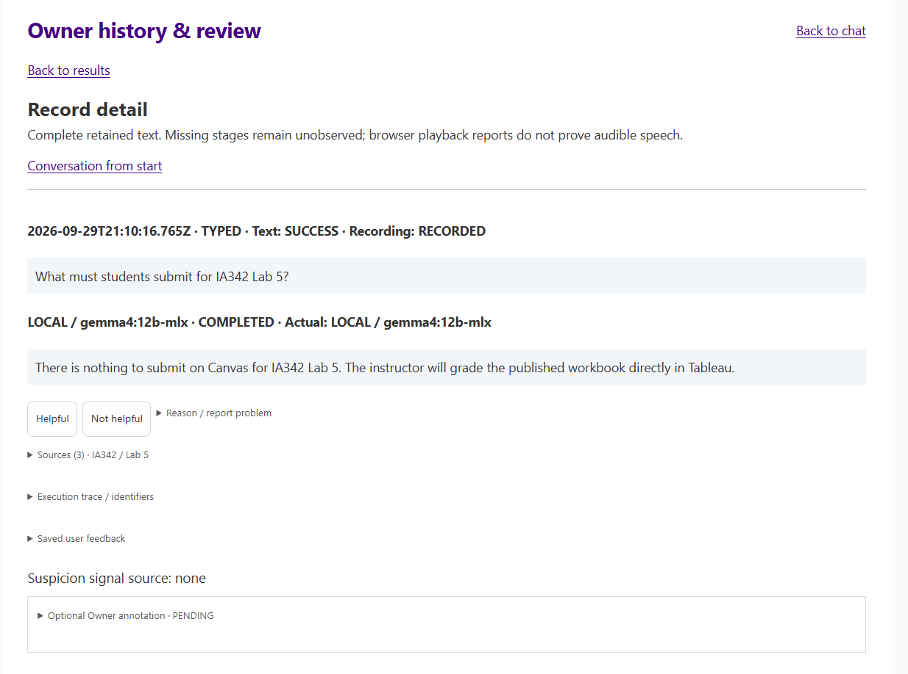

# Local History & Review

Open `/history` through the same protected operator HTTPS entry. All records and Problems views support search/filter and source/provider/model/execution inspection. Feedback and operator review are local writes. Problems include recorded failures, incomplete capture, reports, Not helpful feedback, suspicion signals and confirmed issues; pending review alone is not a failure.

The existing SQLite store retains full text questions, successful transcripts, answers, snapshot course/commit identity, citations, diagnostics, feedback and review state. Its schema migration/recovery behavior is tested with synthetic databases. Archival browsing never calls Local or Cloud. Execution detail describes recorded events, not guessed missing phases.

New conversation clears active model context, not saved history. No automatic expiry/deletion schedule or encrypted-at-rest storage is implemented. Protect your account/disk and runtime directory. Preserve the store before diagnosing capture or migration failures; do not blindly delete/recreate it to hide a problem. Raw microphone/generated audio is temporary and is not archived in the store.

This is one operator's dashboard, with no separate dashboard password, per-person permissions or multi-user record isolation. A person who can access the operator entry can review its history. Never expose the reference entry as a public student/admin system.

## Dashboard example

This Owner-provided capture shows an earlier History record-detail view for a public demo-course question: retained answer, requested/actual Local model, Sources, execution detail, feedback and operator annotation. It is an illustration, not evidence of LAITA Public V1's answer correctness or student deployment. The UI text and timestamp are preserved; no student identifiers, credentials or private host/path are visible. [Source/privacy review](SCREENSHOTS.md).

## Date filters

API `since` / `until` filters use canonical UTC timestamps with exactly three millisecond digits (`YYYY-MM-DDTHH:mm:ss.sssZ`), matching retained timestamps and SQLite text ordering. Normalize an integration's date with `Date.toISOString()` before submitting it. Invalid calendar dates and noncanonical precisions/offsets return 400 before querying storage; archived filtering never invokes a provider.
